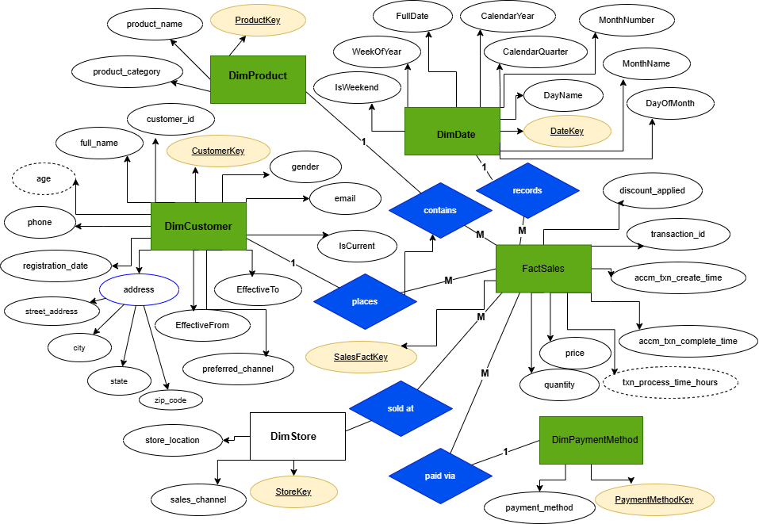
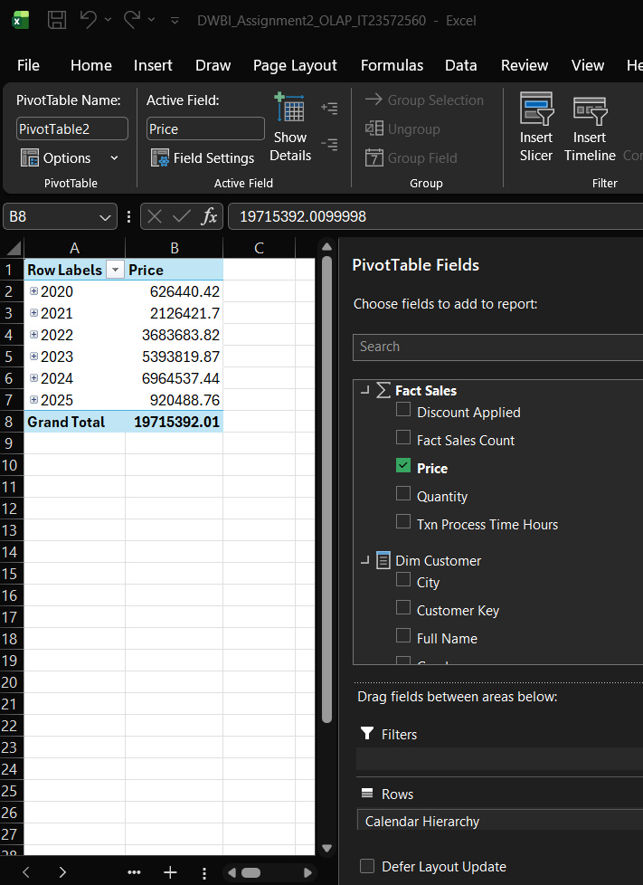

<div align="center">

# 📊 Retail DWBI Cube Project

A retail Data Warehousing and Business Intelligence project developed using **SQL Server, SSIS, SSAS Multidimensional, Excel, and Power BI**.


</div>

## Project Overview

This project analyses retail sales data from **2020 to 2025** using a star-schema data warehouse.

It includes:

* Retail data warehouse
* SSAS multidimensional cube
* Excel OLAP analysis
* Power BI reports and dashboards

## Data Warehouse

The `RetailDW` database contains:

### Fact Table

* `FactSales`

### Dimension Tables

* `DimDate`
* `DimCustomer`
* `DimProduct`
* `DimStore`
* `DimPaymentMethod`

<div align="center">



</div>

## OLAP Operations

The following OLAP operations were demonstrated using Excel:

* Roll-Up
* Drill-Down
* Slice
* Dice
* Pivot

<div align="center">



</div>

## Power BI Reports

The Power BI solution includes:

* Matrix visual report
* Cascading slicers
* Sales trend analysis
* Payment method analysis
* Drill-down report
* Drill-through report

<div align="center">


</div>

## Technologies

* Microsoft SQL Server
* SQL Server Management Studio
* SQL Server Integration Services
* SQL Server Analysis Services
* Visual Studio
* Microsoft Excel
* Power BI Desktop
* Draw.io

## Repository Structure

```text
├── OLAP
├── Power BI
├── RetailCubeProject
├── screenshots
├── Assignment2_IT23572560.pdf
├── er.drawio.png
└── README.md
```

## Author

**Chamodi Kumarage**

BSc (Hons) in Information Technology
Specialising in Data Science
Sri Lanka Institute of Information Technology

[GitHub Profile](https://github.com/chamodi-kumarage)

---

<div align="center">

⭐ Thank you for visiting this project.

</div>
